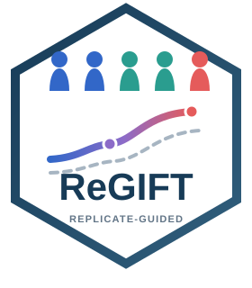
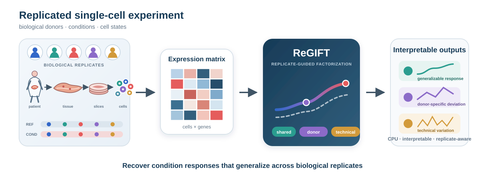

<p align="center">
  
</p>

<h1 align="center">ReGIFT</h1>

<p align="center"><strong>Replicate-Guided Matrix Factorization for Single-Cell Transcriptomics</strong></p>

<p align="center">
  <a href="https://github.com/haohaostats/ReGIFT/actions/workflows/R-CMD-check.yaml"></a>
  
  
  <a href="LICENSE"></a>
</p>

<p align="center">
  
</p>

ReGIFT is an R package for recovering condition responses that generalize
across biological replicates while separating donor-specific deviations and
technical variation. Performance-critical updates are implemented in C++ via
Rcpp and run on CPU; a GPU is not required.

## Why ReGIFT?

| Generalizable response | Replicate-aware separation | Practical implementation |
|:--|:--|:--|
| Recovers condition programs shared across biological donors. | Separates shared response, donor-specific deviations, and technical variation. | Interpretable R interface with compiled C++ updates and no GPU requirement. |

## Installation

Install the development release from GitHub with:

```r
if (!requireNamespace("remotes", quietly = TRUE))
  install.packages("remotes")
remotes::install_github("haohaostats/ReGIFT")
```

A local source checkout can be installed with:

```r
install.packages(".", repos = NULL, type = "source")
```

## Quick start

```r
library(ReGIFT)
data(regift_example)

fit <- regift(
  counts = regift_example$counts,
  meta = regift_example$meta,
  donor = "donor",
  sample = "sample",
  condition = "condition",
  state = "state",
  reference = "control",
  threads = 4,
  max_iter = 20
)

fit
head(regift_response_table(fit, "T1D-control"))
```

`regift_example` is a compact, deterministic subset of the public HPAP
pancreatic-islet dataset (GSE148073): five T1D donors, five control donors,
four cell states, and 240 genes. The full HPAP object is not bundled.

Input count matrices must have cells in rows and genes in columns. Metadata
must contain one row per cell and identify biological donors, samples, and
conditions. A coarse state annotation is optional.

## Web application

A hosted ReGIFT Shiny application will provide a graphical interface using the
same R package computational engine. Only the deployed application link—not
the Shiny source code—will be published in this repository.

## Scope

This repository contains the ReGIFT user software. Manuscript figure scripts,
benchmark implementations, and public-data reproduction workflows are not part
of the R package distribution.

## License

ReGIFT is released under the MIT License.
